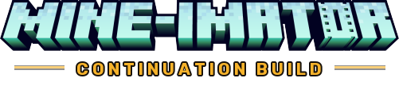

# Mine-imator Reforged

  
   
   
  

**Mine-imator Reforged 1.0.1** — based on Mine-imator 2.0.2.

Mine-imator Reforged is a community continuation of [Mine-imator](https://www.mineimator.com), the 3D movie maker based on the sandbox game Minecraft, with over 10 million downloads since its launch in 2012. This fork keeps the project alive with its own identity, versioning, and builds while staying true to the original.

## Versioning

| Channel | Version | Date |
|---|---|---|
| Base Mine-imator | 2.0.2 | 2023.11.12 |
| Reforged | 1.0.1 | 2026.09.05 |

The full in-app version reads `2.0.2 Reforged 1.0.1`. Platform file versions use `<base>.<build>`, e.g. `2.0.2.2`. See [CHANGELOG.md](CHANGELOG.md) for details.

## What's different in Reforged

* New identity: **Mine-imator Reforged** with a gold-accented logo, app icons, and loading screen art
* Dedicated version line on top of the 2.0.2 base, shown in the startup screen, loading screen, About dialog, log, and crash reporter
* About dialog credits the Reforged maintainers alongside the original team
* Crash reporter points to this repository's issue tracker

## Building

The software is written using GameMaker Language and converted to a separate C++ environment using a custom built GML parser (CppGen). The final executable is built for Windows, Mac OS and Linux using the Qt framework, DirectX/OpenGL rendering and various other libraries.

You can open `GmProject/Mine-imator.yyp` directly in GameMaker on Windows (it may need to be converted), but to support all features you must build and run the C++ project. For full build instructions, see `BUILD.md`.

## Links

* Original website and download: https://www.mineimator.com
* Reforged repository: https://github.com/OmniNodeCo/Mine-imator

## Credits

Mine-imator was created by David Andrei, with development by David, Nimi, Marvin and mbanders, and UI/branding by Voxy — see the in-app About dialog for the full credits including beta testers. Reforged is maintained by [OmniNodeCo](https://github.com/OmniNodeCo/Mine-imator). Minecraft is a trademark of Mojang Synergies AB; this is an unofficial community continuation, not affiliated with Mojang or Microsoft.
